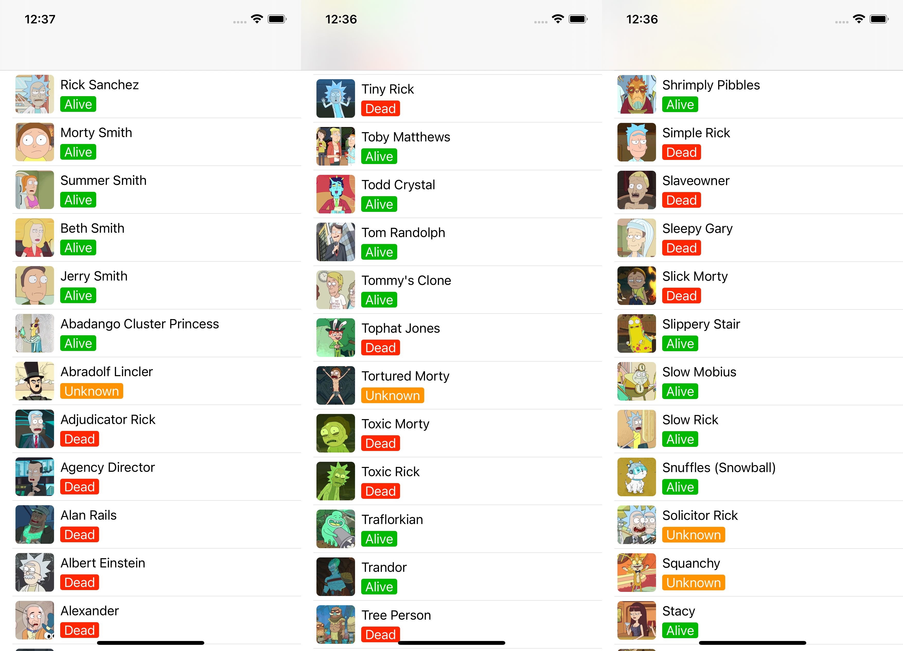

# Rick and Morty

SwiftUI app for all Rick and Morty characters

> <strike>Currently limited to 20 characters. Next update will include [pagination](#todo) to load more characters.</strike> This project uses [swift-request](https://github.com/carson-katri/swift-request) which can be installed via the `Swift Package Manager`.

## TODO
- [x] Load more characters *(Pagination)*

## Documentation
Rick and Morty API [docs](https://github.com/afuh/rick-and-morty-api)
